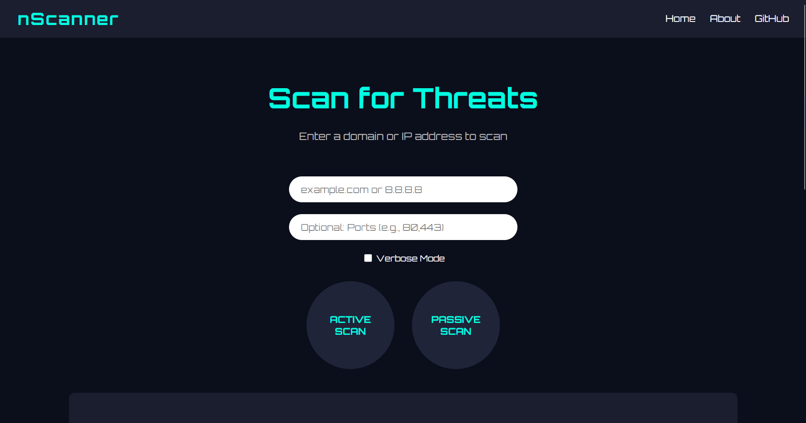

# 🔍 nScanner – Web-Based InfoSec Recon Tool

**nScanner** is a cybersecurity utility that performs **active port scanning** and **passive reconnaissance** on domains or IPs. Built with **Flask**, **Python-Nmap**, and **IPWhois**, it’s designed to be simple, educational, and powerful.

> ⚠️ For educational and personal use only. Not for unauthorized or commercial use.

---

## 🚀 Features

- 🌐 Web-based interface (Flask)
- 🔎 Active scanning using `nmap`
- 👁️ Passive info from HTTP headers, IP info, and WHOIS
- 🧠 Rate-limiting protection via Flask-Limiter
- 🎨 Clean UI with Orbitron-styled theme

---

## 🎥 Demo

### 📸 Screenshot



### 📹 Demo Video

> 📽️ Click below to download and view the video:

[](introduction/demo/scanning.mp4)

---

## 🧠 Prerequisites

- Python 3.10+
- `nmap` installed and added to PATH (for local scan mode)

---

## 💻 Local Setup Instructions

1. **Clone the repository**  
   ```bash
   git clone https://github.com/Anushree401/nScanner.git
   cd nScanner
   ```

2. **Create virtual environment and activate**

   ```bash
   python -m venv venv
   venv\Scripts\activate    # On Windows
   # OR
   source venv/bin/activate # On Linux/macOS
   ```

3. **Install dependencies**

   ```bash
   pip install -r requirements.txt
   ```

4. **Run the app**

   ```bash
   python app.py
   ```

5. **Visit it**

   ```
   http://localhost:5000
   ```

---

## 🐳 Run with Docker (No need to install Python or nmap)

1. **Build the Docker image**

   ```bash
   docker build -t nscanner .
   ```

2. **Run the container**

   ```bash
   docker run -p 5000:5000 nscanner
   ```

3. **Open in browser**

   ```
   http://localhost:5000
   ```

---

## 📄 License

This project is under a **Restricted Educational Use License**.
See [`LICENSE`](introduction/LICENSE) for full terms.

---

## 🙋‍♀️ Author

**Anushree Balaji**
📧 [anushree1606balaji@gmail.com](mailto:anushree1606balaji@gmail.com)
🔗 [GitHub – Anushree401](https://github.com/Anushree401)

---

## 🌟 Contribute?

This project is under a restricted-use license.
If you’d like to collaborate or reuse the code under another license, contact me via email.

```

---

```
